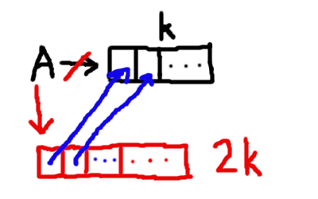
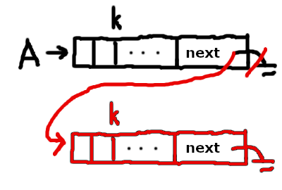

# 2.03.2020

## Как правильно организовать проект?

```
root/
	README.MD
	src/
	tests/
		test_data
```

В test_data могут храниться любые файлы, нужные для тестирования.

Иногда тесты выносятся в отдельное решение.

### Как реализовать ResizeArray?

Варианты:



либо



## А теперь плавно перейдем к F#

Иронично.

В F#, в той части, где он функционален, нет состояний. Тем не менее, это .net-язык, значит, с ним может без проблем взаимодействовать C#, в нем можно писать объектно-ориентированно и вообще как хочешь.

### Связывание переменных

Типизация строжайшая. Настолько, что тип переменной не обязательно указывать тип.

Например,
```fsharp
let x = 1
```
значит присвоить куску памяти, в котором лежит 1, имя x. Т. е. нет присваивания, а есть **связывание**.

### Функции

Функция в F# -- основной тип абстракции.

Пример:
```fsharp
let f x y = x + y
```
Завели функцию, складывающую 2 числа.

Более того, функции можно частично применить.
```fsharp
let g = f 2
```
Получили g(x) = x + 2. Т. е.
```fsharp
let y = g 4
```
свяжет y и 6.

Это очень важная концепция, называемая, **каррирование**.

Основным типом абстракции функции являются, т. к. могут быть переданы как аргументы в другую функцию. Например
```fsharp
(* Завели функцию композиция *)
let compose g f x = g(f(x))

let f x = x + 1

let g x = x * x

(* h1(x) = x*x + 1 *)
let h1 = compose f g

(* h2(x) = (x + 1) * (x + 1) *)
let h2 = compose g f

let x1 = h1 3

let x2 = h2 3

(* Получили x1 = 10, x2 = 16 *)
```

**NB!:** Функции в F# всегда принимают один аргумент, например ниже определенные функции не равны.
```fsharp
(* val f: (int -> int -> int) *)
let f x y = x + y

(* val g: (int * int -> int) *)
let g (x, y) = x + y
```
т.е.
```fsharp
let h y = y + 1

let H = g h
```
Вообще вызовет ошибку.

### Как конструировать новые типы?

Пусть у нас уже были типы t0, t1, ... Дальше мы можем поступить двумя способами:

1. Создать кортежи разнородных элементов. Получим нечто, хранящее сразу несколько разных вещей.
```fsharp
	let make_pair x y = x, y
	let new_t0el = make_pair t0el t1el
	
	(* Как-то живем с этим дальше... *)
```
На самом деле, не совсем понятно, зачем делать так, когда можно создать **запись**. Это будет по-настоящему новый тип.
```fsharp
	type ContactCard = {
    Name: string
    Phone: string
    Verified : bool
    }
	
	(* Создаем экземпляр. *)
	let contact1 = {
	Name = "Alf"
	Phone = "(206) 555-0157"
	Verified = false
	}
	
	(* Доступ к элементам записи осуществляется через точку *)
	let card1IsVerified = contact1.Verified
```
1. Создать **размеченные объединения**. Получим нечто, хранящее какую-то одну вещь.
```fsharp
	type new_t0 = T0 of t0 | T1 of t1
	let new_t0el = T0(t0el)
	
	(* В месте, где надо работать с содержимым нового типа *)
	match new_t0el with
		T0(x) -> (* Обрабатываем случай, когда new_t0el содержал элемент типа t0. *)
		| T1(x) -> (* Обрабатываем случай, когда new_t0el содержал элемент типа t1. *)
```

### Когда полезна немутабельность?

В параллельных программах, т. к. не бывает общих переменных.