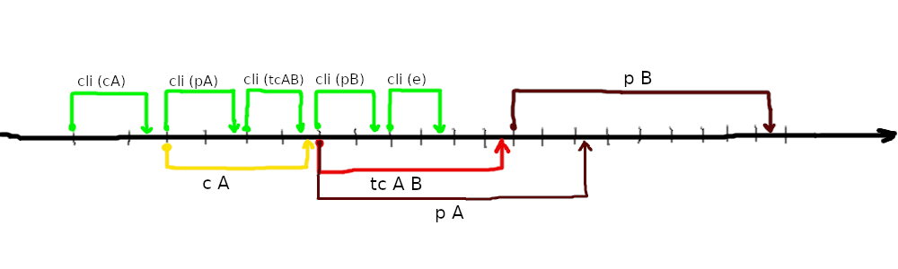
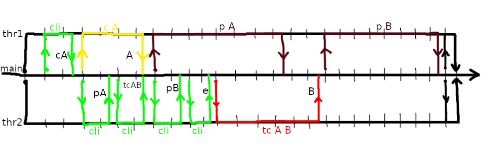

# 16.03.2020

## Комментарии к д/з

В д/з на этот день в F# реализации матрицу, возможно, стоит сделать классом, а не типом.

## Организация модулей на F#

В F# важна последовательность файлов. Если есть несколько модулей, один из которых использует другой, файлы при компиляции должны идти в правильном порядке.

### Пример

Пусть программа состоит из трех файлов со следующим содержимым.

- _Useful.fs_
```fsharp
	module Useful
	
	let addOne = (+) 1
```

- _VeryUseful.fs_
```fsharp
	module VeryUseful
	
	let three = Useful.addOne 2
```

- _Program.fs_
```fsharp
	open Useful
	open VeryUseful
	
	let main _ =
		let four = addOne three
		0
```

Как видно, код _Program.fs_ использует модули описанные в _VeryUseful.fs_ и _Useful.fs_. В свою очередь код _VeryUseful.fs_ использует модуль из _Useful.fs_. Т. о. компиляция должна проходить в порядке _Useful.fs_ --> _VeryUseful.fs_ --> _Program.fs_, что отражается в _fsproj_-файле.

_ProjectName.fsproj_
```xml
<Project Sdk="Microsoft.NET.Sdk">

  <PropertyGroup>
    <OutputType>Exe</OutputType>
    <TargetFramework>netcoreapp3.1</TargetFramework>
  </PropertyGroup>

  <ItemGroup>
    <Compile Include="Useful.fs" />
    <Compile Include="VeryUseful.fs" />
    <Compile Include="Program.fs" />
  </ItemGroup>

</Project>
```

## Модуль List

Для работы над списками часто используются следующие функции:
- ```List.map : ('T -> 'U) -> 'T list -> 'U list``` -- Создает коллекцию, элементы которой являются результатами применения переданной функции к каждому элементу переданной коллекции.
- ```List.iter : ('T -> unit) -> 'T list -> unit``` -- Применяет переданную функцию к каждому элементу коллекции.
- ```List.fold : ('State -> 'T -> 'State) -> 'State -> 'T list -> 'State``` -- Пусть вызвана ```List.fold f s t_list```, где ```f : ('State -> 'T -> 'State)```, ```s : 'State```, ```t_list = [i0; i1; ... ; in] : 'T list```. Тогда ее результатом будет ```f( ... (f s i0) i1 ... ) in```.

## Параллельность

### Параллельность низкого уровня

Используется параллельность на уровне цикла. В F# такую параллельность реализуют, например, следующие функции:

- ```Array.Parallel.map```
- ```Array.Parallel.iter```

Они полностью аналогичны одноименным функциям List, но работают с массивами.

### Параллельность высокого уровня

Используется параллельность на уровне задач. Имеет несколько видов.

В качестве примера везде используем одну и ту же задачу и одни и те же действия пользователя:

- Нужна программа, которя интерактивно работает с пользователем. Пользователь может попросить:
	- Создать случайную матрицу с некотрыми параметрами.
	- Посчитать транзитивное замыкание матрицы.
	- Напечатать матрицу.
	- Завершить программу.
- Пусть по скорости ввод > создание > замыкание > печать
- Пусть пользователь попросил
	1. создать матрицу A (далее -- c A)
	1. напечатать A (далее -- p A)
	1. посчитать транзитивное замыкание A и положить в B (далее -- tc A B)
	1. p B
	1. выйти из программы (далее -- e)

#### Fork-join параллелизм

Программа работает последовательно до некоторой заранее определенной точки, после чего ветвится (fork) на несколько потоков. Каждый поток выполняется параллельно, после чего сливается (join) с основным потоком выполнения. На протяжении работы программы это может происходить несколько раз. Ветвление может быть рекурсивным. Все потоки имеют общее адресное пространство.

Пример в этом случае может быть реализован так:
- Основной поток -- занимается распределением задач, хранит их список. Раз в некоторе время он должен смотреть, какие потоки закончили свою работу, и следить за тем, чтобы, если можно начать выполнять новую задачу, то она начала бы выполняться.
- Клиент -- слушает запрос от пользователя и возвращает их.
- Генератор -- создает случайную матрицу, исходя из заданных параметров, и возвращает ее.
- ТЗ -- считает транзитивное замыкание матрицы и возвращает его.
- Принтер -- печатает матрицу и возвращает, успешно ли ему это удалось.

А работать будет так:



##### ThreadPool

Есть проблема: на создание потока, задание ему задачи и т. д. требуется много времени. Частичное решение -- пул потоков.

Пул потоков хранит в себе некоторое заранее заданное количество потоков и очередь задач. В пул можно добавить задачу на выполнение. Если при добавлении все потоки заняты, задача отправляется в очередь, и, когда один из потоков освободится, она будет ему передана.

Пример в этом случае может быть реализован так: основной поток создает пул потоков (с двумя потоками) и следит за тем, чтобы задачи помещались в пул в правильном порядке (например, p B не раньше tc A B, а также нельзя занимать все потоки сразу, т. к. иначе некому общаться с пользователем).

Иллюстрация:



#### Агентно ориентированное программирование.

Каждый агент стартует один раз и выполняется в своем адресном пространстве.

Самое сложное -- убить всех агентов. Удобно каждому агенту посылать сообщение всем заинтересованным, что от него больше ничего ждать не нужно.

Для работы с такими агентами есть mailboxProcessor.

картинка (транзитивное замыкание, клиент, генератор матриц, принтер общаются)

## Анонс

- Хотим побаловаться с параллельностью (двух видов).
- А потом еще будем железо мучить: заставлять работать графический процессор с помощью Brahma.FSharp (библиотека создана на МатМехе).
- В итоге хотим отчет о том, где быстрее происходит работа с матрицами.